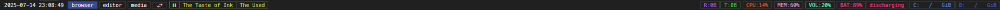

# Miscellaneous scripts and such

Repo of scripts and such that in itself isn't repo worthy.

Everything is licensed under MIT, unless specified otherwise in the file or a directory that contains a LICENSE file.

<h2><a href="AutoHotkey V1">AutoHotkey V1</a></h3>

<h3>- <a href="AutoHotkey V1/AutoCAD binds.ahk">AutoCAD binds</a></h3>

Bind keys to specific commands that are used 90% of the time for 2D sketching on AutoCAD.

<!-- subsection-seperator -->

<h3>- <a href="AutoHotkey V1/BoxDwgChars.ahk">BoxDwgChars</a></h3>

Type box drawing characters using numpad.

<!-- subsection-seperator -->

<h3>- <a href="AutoHotkey V1/ChaoticKeyboard.ahk">ChaoticKeyboard</a></h3>

Typing with random letterlike symbols.

<!-- subsection-seperator -->

<h3>- <a href="Autohotkey V1/controllerDesktopInput.ahk">controllerDesktopInput</a></h3>

Middleware to control your desktop with a controller

<!-- subsection-seperator -->

<h3>- <a href="AutoHotkey V1/DrawingTemplate.ahk.ahk">DrawingTemplate</a></h3>

Template script to use <a href="https://github.com/geovens/gInk">gInk></a> with a mouse or a drawing tablet and binding hotkeys for specific programs when using a drawing tablet.

<!-- subsection-seperator -->

<h3>- <a href="AutoHotkey V1/getKeyInfo.ahk">getKeyInfo</a></h3>

Tool to get information about your next keystroke.

<!-- subsection-seperator -->

<h3>- <a href="AutoHotkey V1/LaTeX shortcuts.ahk">LaTeX shortcuts</a></h3>

Keybinds to insert general LaTeX symbols&commands.

<!-- subsection-seperator -->

<h3>- <a href="AutoHotkey V1/mousePosColorTooltip.ahk">mousePosColorTooltip</a></h3>

Handy script to see which pixels your cursor is at, color of the pixel and copy those into the clipboard.

<!-- subsection-seperator -->

<h3>- <a href="AutoHotkey V1/TauonGlobalHotkeys.ahk">TauonGlobalHotkeys</a></h3>

Media control using Tauon's HTTP API, also shows tooltips to mitigate the program not having notifications.

<!-- subsection-seperator -->

<h3>- <a href="AutoHotkey V1/timer.ahk">timer</a></h3>

A simple always on top, resettable timer.

<!-- section-seperator -->

<h2><a href="Config">Config</a></h2>

<h3>- <a href="Config/Firefox/">Firefox</a></h3>

Condensed firefox with tabs on sidebar.

<!-- subsection-seperator -->

<h3>- <a href="Config/glazewm/">glazewm</a></h3>

My take on [glazewm](https://github.com/glzr-io/glazewm) that doesn't interfere with accesibility keys.

<!-- subsection-seperator -->

<h3>- <a href="Config/oh-my-posh">oh-my-posh</a></h3>

Simple oh-my-posh theme.

<!-- subsection-seperator -->

<h3>- <a href="Config/PowerShell">PowerShell</a></h3>

Shorthands & etc.

<!-- subsection-seperator -->

<h3>- <a href="Config/Yazi">Yazi</a></h3>

Yazi with some keybind changes and opening dirs with file manager.

<!-- subsection-seperator -->

<h3>- <a href="Config/zebar">zebar</a></h3>

Simple [zebar](https://github.com/glzr-io/zebar) that gives you the full context of what's going on.

<!-- section-seperator -->

<h2><a href="Miscellaneous">Miscellaneous</a></h2>

<h3>- <a href="Miscellaneous/autoexec.cfg">All-In-One Dota2 Config</a></h3>

Config file for Dota2 that encompasses most of what you'd need or want.

<h2><a href="Python">Python</a></h2>

<h3>- <a href="Python/AutoHotkey-Layout-Visualizer/">AutoHotkey-Layout-Visualizer</a></h3>

[Details](Python/AutoHotkey-Layout-Visualizer/readme.md)

<!-- subsection-seperator -->

<h3>- <a href="Python/embedclipimgasbase64md">embedclipimgasbase64md</a></h3>

[Details](Python/embedclipimgasbase64md/readme.md)

<!-- section-seperator -->

<h2><a href="Style Sheets">Style Sheets</a></h2>

I'd recommend you to get userstyles through [here](https://userstyles.world/user/egezenn) using a userstyles add-on (e.g [Stylus](https://github.com/openstyles/stylus)).

<h3>- <a href="Style Sheets/Clean DU.styl">Clean DU</a></h3>

Style written in Stylus style sheet language, aiming to fix what's broken and improve on in [Duzce University](https://duzce.edu.tr) pages.

<!-- subsection-seperator -->

<h3>- <a href="Style Sheets/Discord Declutter.css">Discord Declutter</a></h3>

Fixes discord.

<!-- subsection-seperator -->

<h3>- <a href="Style Sheets/Fullwindow theatre.styl">Fullwindow Theatre</a></h3>

Makes the Youtube player as big as possible in theatre mode.

<!-- subsection-seperator -->

<h3>- <a href="Style Sheets/No Unnecessary Scroll For Free Games.styl">No Unnecessary Scroll For Free Games</a></h3>

Removes Epic Games scroll nuisance.

<!-- subsection-seperator -->

<h3>- <a href="Style Sheets/Obsidian Minimizer.css">Obsidian Minimizer</a></h3>

[Obsidian](https://obsidian.md) snippet that tries to minimize & simplify every single aspect of the editor UI, in a hacky way.

